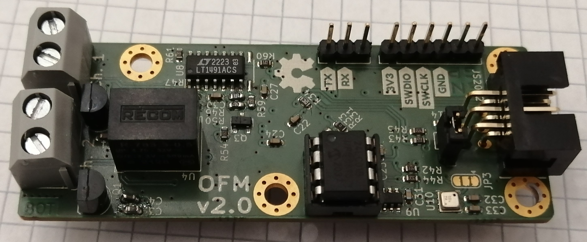
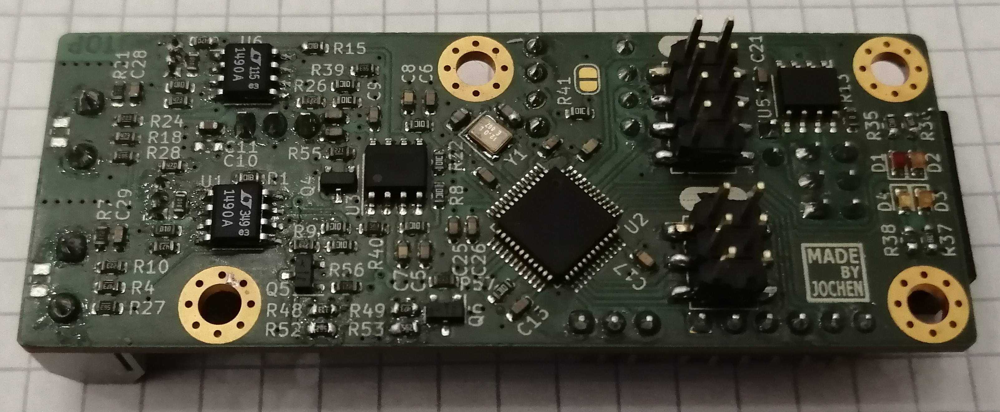

# OpenFlowMeter
## Purpose
Measuring flow of gases and maybe liquids. 

## Principle
Measures the volume flow by the amount of heat transferred to a gas flow. This can be either done by constantly heating the sensor or by evaluating temperature cycles.

# Hardware
The hardware is based around two voltage controlled current sources, which are controlled and readout via a STM32F103 microcontroller. 
The controller provides the ADCs for reading the voltages and current as well as the digital communication to the outside of the PCB.

## Photographs of the populated PCB

# References
The working principle of this device is adapted from a proposal of the LHC gas group at CERN. In addition there is a report of a student, explaining / proposing this technique more in detail.

[1] M. van der Klis. PT100 Channel Flowmeter for the LHC Experiments, Technical Student Report Feb. 2001

# PCBs
PCBs are available from AISLER https://aisler.net/p/MVHMBVKT
